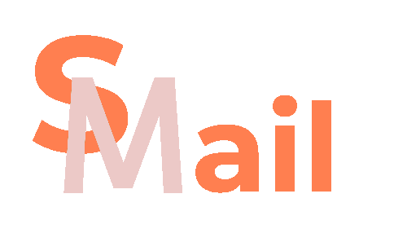

# SimpleMail Web Application




## Introduction

SimpleMail is a web application developed using Django, designed to provide a basic yet functional email communication platform. This project demonstrates my knowledge, and skills in Python, and web development with Django, including user authentication, database management, and more.

*Note: This is an open-source project created for educational purposes.*

## Features

- User Registration and Authentication
- Sending and Receiving Simple Text Messages
- User Profiles
- Real-time Date Display

## Technologies Used

- Django (Python Web Framework)
- PostgreSQL (Database)
- Whitenoise (Static File Handling)
- HTML, CSS

## Project Structure

The project directory structure is organized as follows:

- `MainApp`: The main Django app that contains the core project files.
- `SimpleMailProject`: Django basic-settings files.
- `media`: Directory for storing user-uploaded media files (e.g., user avatars).
- `static`: Directory for static files such as stylesheets and static images.
- `MainApp/templates`: HTML templates used for rendering web pages.

## Installation and Usage

To run the project on your local machine, follow these steps:

1. Clone the repository:

   ```
   git clone https://github.com/progdad/simplemail.git
   cd simplemail
   ```

2. Set up a virtual environment:

   ```
   python -m venv venv
   source venv/bin/activate
   ```

3. Install project dependecies:

   ```
   pip install -r requirements.txt
   ```

4. Apply database migrations:

   ```
   python manage.py migrate
   ```

5. Start the development server:
   
   ```
   python manage.py runserver
   ```

6. Open a web browser and access the application at http://localhost:8000.

## Screenshots


## License

This project is licensed under the MIT License. See the [LICENSE](./LICENSE.md) file for details.

## Contributions

Contributions to this open-source project are welcome. Feel free to fork the repository and submit pull requests to help improve the project.

.

Author: [progdad](https://github.com/progdad)
